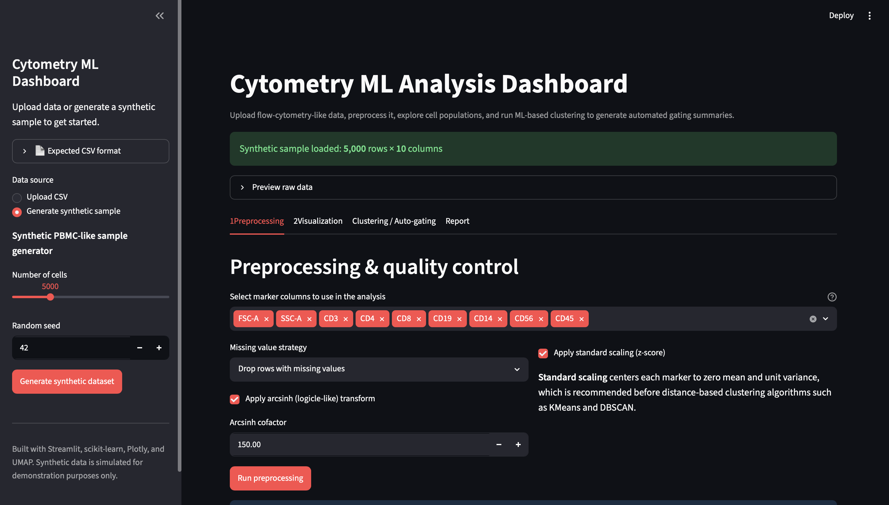
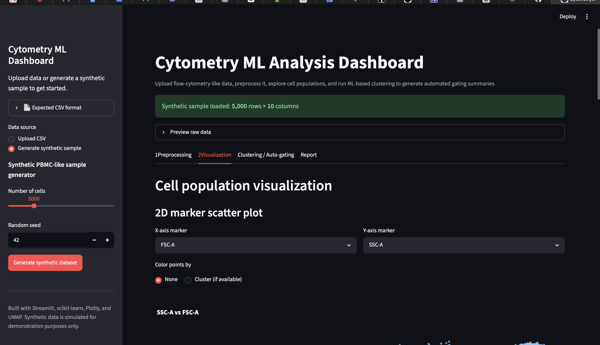
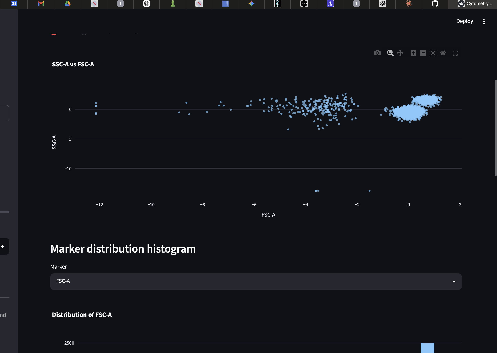
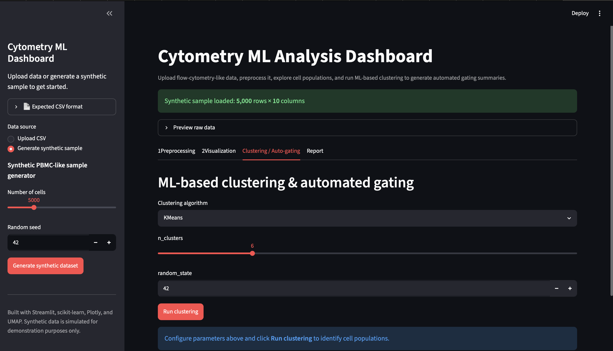
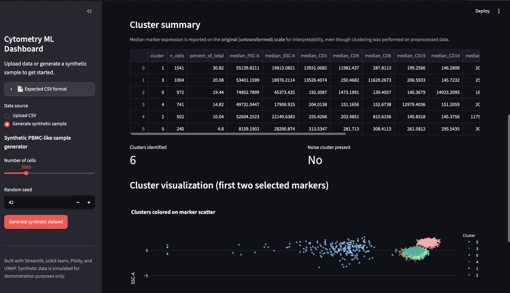
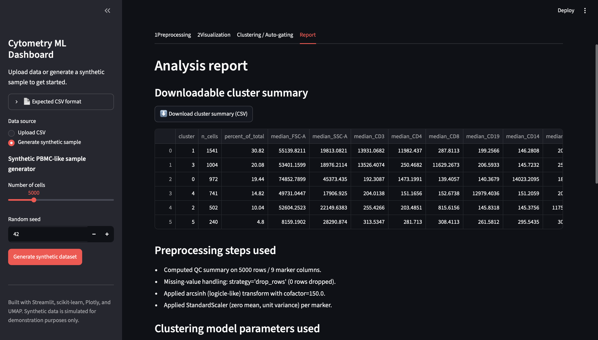

# Cytometry ML Analysis Dashboard

An interactive web application for exploring flow-cytometry-like single-cell
data: upload or simulate data, preprocess it, visualize cell populations,
run ML-based clustering ("automated gating"), and export an analysis report
— all from the browser, no notebook required.

Built with **Python, Streamlit, pandas, scikit-learn, Plotly, and UMAP**.

>  **Disclaimer:** This is a portfolio/demonstration project. The
> synthetic dataset and auto-gating heuristics are simplified analogues of
> real immunophenotyping workflows and are **not validated for clinical,
> diagnostic, or research use**.

---

## What it does

| Step | What happens |
|---|---|
| **1. Load data** | Upload a CSV of marker intensities, or generate a realistic synthetic PBMC-like dataset with one click |
| **2. Preprocess** | Select marker columns, handle missing values, apply an arcsinh ("logicle-like") transform, standard-scale, and review a QC summary |
| **3. Visualize** | Interactive Plotly scatter plots, marker histograms, PCA, and UMAP projections |
| **4. Cluster / auto-gate** | Run KMeans, DBSCAN, or Gaussian Mixture clustering; get a per-cluster summary with median marker expression and a rule-based "likely population" note |
| **5. Report** | Download the cluster summary as CSV, and view/download an auto-generated **Methods Summary** written in scientific-report style |

---

## Screenshots

### Preprocessing & QC

### Visualization

### Clustering & Auto-gating

### Report

